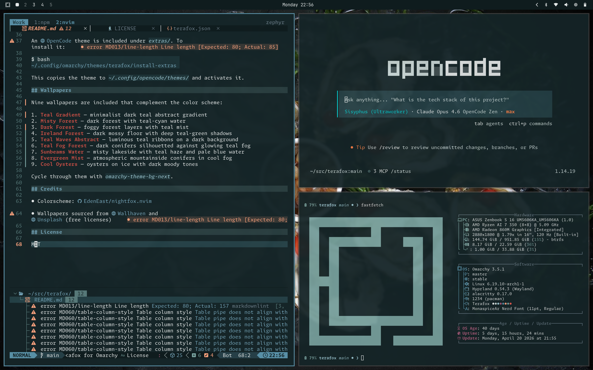

# Terafox for Omarchy

A dark teal theme for [Omarchy](https://omarchy.org/) based on the [Terafox](https://github.com/EdenEast/nightfox.nvim) colorscheme from the Nightfox family.



## Palette

| Role       | Color                                                        |
|------------|--------------------------------------------------------------|
| Background |  `#152528` |
| Foreground |  `#e6eaea` |
| Red        |  `#e85c51` |
| Green      |  `#7aa4a1` |
| Blue       |  `#5a93aa` |
| Cyan       |  `#a1cdd8` |
| Magenta    |  `#ad5c7c` |
| Orange     |  `#ff8349` |
| Yellow     |  `#fda47f` |

## Install

```bash
omarchy-theme-install git@github.com:brianstarke/omarchy-terafox-theme.git
```

This installs the theme and applies it immediately. It includes:

- Terminal colors (Alacritty, Kitty, Ghostty)
- Waybar styling
- btop theme
- Neovim colorscheme (via nightfox.nvim)
- VS Code theme (via Nightfox extension)
- Prussian green icon set
- Nine matching wallpapers

### OpenCode theme (optional)

An [OpenCode](https://opencode.ai/) theme is included under `extras/`. To install it:

```bash
~/.config/omarchy/themes/terafox/install-extras
```

This copies the theme to `~/.config/opencode/themes/` and activates it.

## Wallpapers

Nine wallpapers are included that complement the color scheme:

1. **Teal Gradient** — minimalist dark teal abstract gradient
2. **Misty Forest** — dark forest with teal-cyan water
3. **Dark Forest** — foggy forest layers with teal mist
4. **Ireland Forest** — dark mossy floor with deep teal-green shadows
5. **Teal Waves Abstract** — luminous teal ribbons on a dark background
6. **Teal Fog Forest** — dark conifers silhouetted against glowing teal fog
7. **Sunbeams Water** — misty lakeside with teal haze and pale blue water
8. **Evergreen Mist** — atmospheric mountainside conifers in cool fog
9. **Cool Oysters** — oysters on ice with dark moody tones

Cycle through them with `omarchy-theme-bg-next`.

## Credits

- Colorscheme: [EdenEast/nightfox.nvim](https://github.com/EdenEast/nightfox.nvim)
- Wallpapers sourced from [Wallhaven](https://wallhaven.cc) and [Unsplash](https://unsplash.com) (free licenses)

## License

MIT
